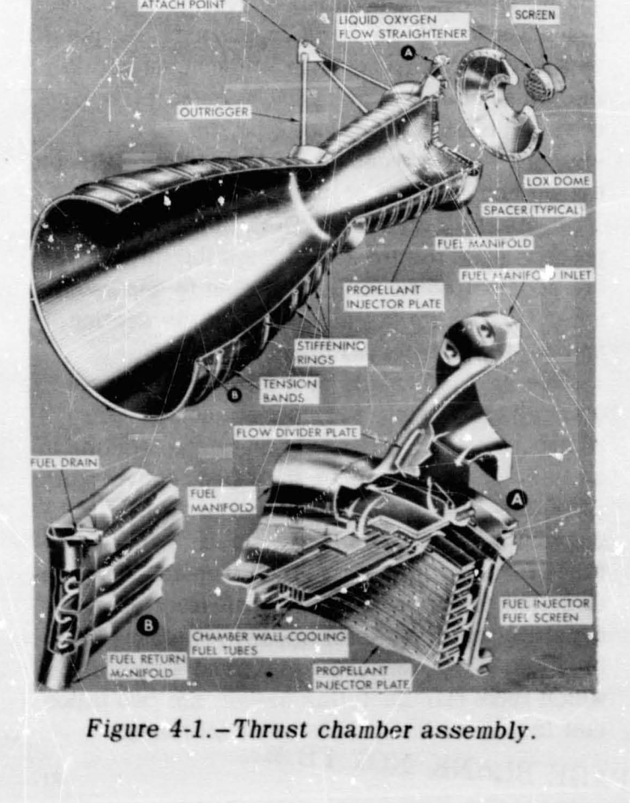
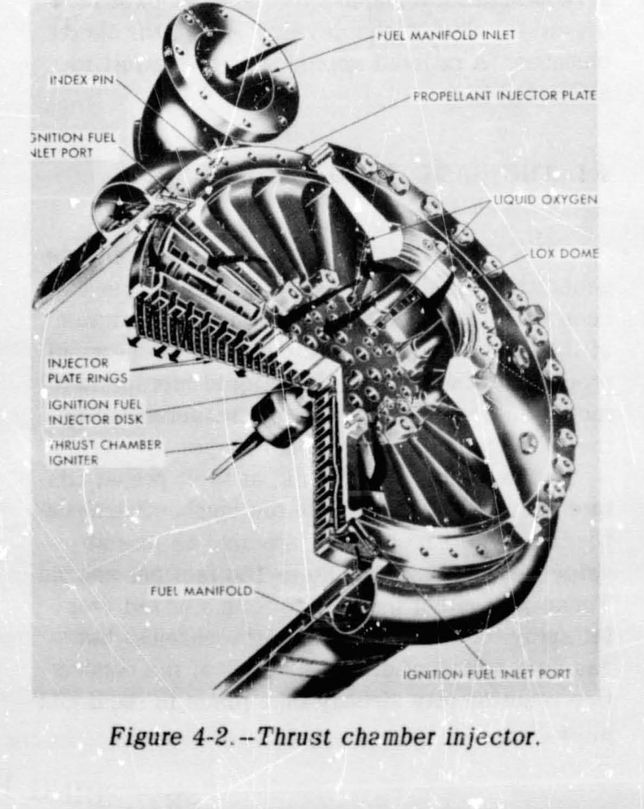
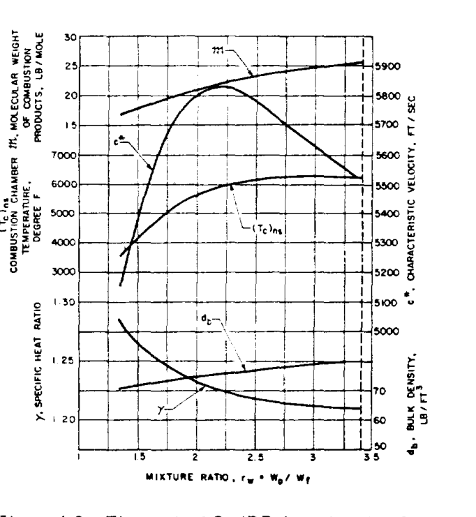
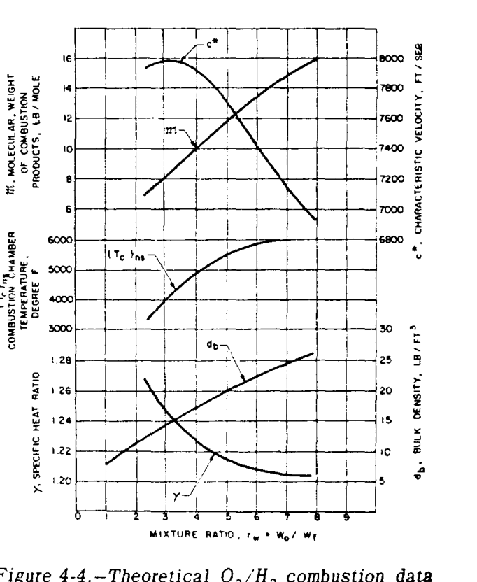
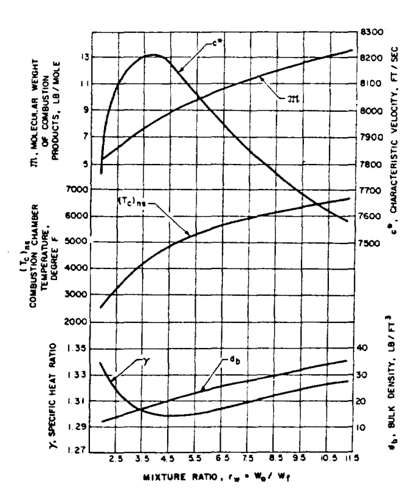
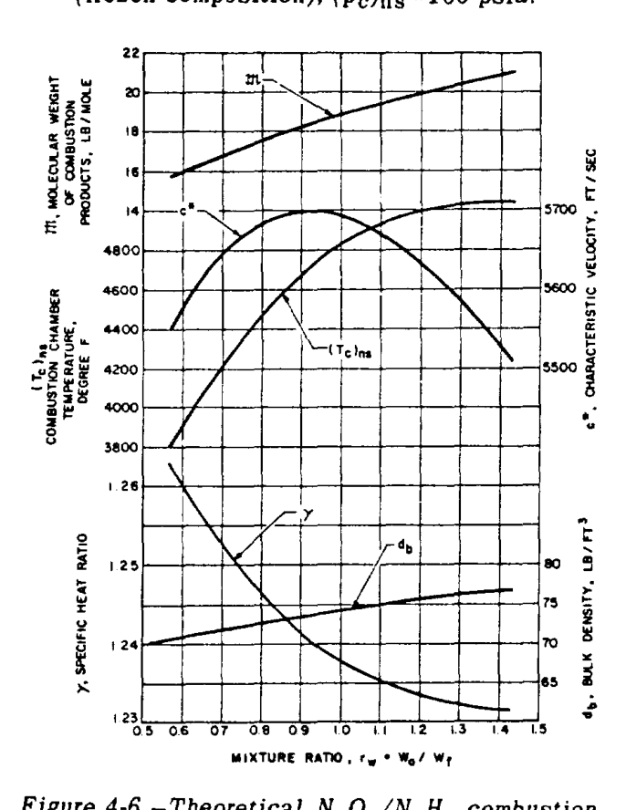

# 第IV章  推力室およびその他の燃焼装置の設計

ロケットエンジンの様々なサブシステムの誇り高き設計者たちは、自らの製品を「エンジンの心臓部」と考えているが、推力室アセンブリがロケット推進の本質を体現していることは否定できない。それは物質の加速と噴射であり、その反作用が車両に推進力を与えるのである。設計者の目標は、本質的にこれを、最高の性能、安定性、耐久性を備え、最小のサイズ、重量、コストで実現することである。  

推力室の設計は、液体推進剤ロケット工学の分野において、より複雑な主題の一つである。これは主に、基礎となるプロセス、特に推力室内での燃焼を分析的に定義し研究することが比較的困難であるという事実に起因している。したがって、ほとんどのエンジン開発プログラムにおいて、推力室の設計と開発には多大な努力が費やされなければならない。ここでは、この努力に対する合理的なアプローチを試みる。  
 
## 4.1 推力室の基本要素

推力室内での推力発生を支配する熱力学的プロセスについては、第I章で扱った。推力室の主な機能は、推進剤のエネルギーを推力に変換することである。液体二液推進剤ロケットエンジンにおいて、このプロセスは以下の基本的な機能的ステップによって特徴づけられる。  

1. 液体推進剤は、適切な混合比で、インジェクタのオリフィスを通じて燃焼室内に、秒速20〜150フィートの速度のジェットとして注入される。これらのジェットは衝突して混合された液滴スプレーを形成するか、あるいは一連の液滴として室内の高温ガス中に直接流れ込む。燃焼反応の一部は、すでに液相で起こっている可能性がある。  
2. 液滴は、その後、周囲のガスからの熱伝達によって蒸発する。液滴のサイズと速度は、燃焼ガス流に同伴される間に連続的に変化する。  
3. 蒸発した推進剤は急速に混合され、さらに加熱され、それらが形成された場所で化学量論的混合比で即座に反応し、燃焼室内のガス質量流量を継続的に増加させる。このガス反応は、活性分子または原子の高速拡散によってさらに助けられる。燃焼は、すべての液体液滴が蒸発した時点で、室のスロートの上流で本質的に完了する。特定の条件下では、燃焼フロントにおける局所的な乱れによって、衝撃波やデトネーション波が発生する場合があり、これは混合プロセスや反応前の推進剤の流れの不安定性によって引き起こされる可能性がある。これらの影響により、推力室内に特定の周波数で持続的な圧力振動が誘発され、破壊的な燃焼不安定性を招く恐れがある。したがって、設計および開発の努力の大部分は、安定した燃焼の達成に向けられる。  
4. 燃焼プロセスのガス生成物がスロートに向かって通過し、そこを通り抜ける際、それらは音速まで加速され、その後、広がるノズルセクション内で超音速まで加速され、最終的に後方に排出される。  

推力室の機能に必要な基本要素には、燃焼室セクション、膨張ノズルセクション、インジェクタ、点火装置（非自己着火性推進剤の組み合わせ用）、推進剤入口および分配マニホールド、ならびにコンポーネントおよび推力マウント用の相互接続面が含まれる。様々な推力室要素の構造は、主にそれらの特定の運用機能に依存する。しかし、製造を容易にする軽量化とシンプルさは、常に考慮されるべき2つの重要な要素である。  

図4-1および図4-2は、典型的な液体二液推進剤ロケットエンジンの推力室アセンブリを示している。図示された推力室アセンブリは、4つの主要なサブアセンブリまたは基本要素、すなわち、推力室本体、インジェクタ、液体酸素ドーム、および点火器で構成されている。  

推力室本体サブアセンブリはベンチュリ形状であり、燃焼が行われる円筒セクション、スロートに向かって狭くなるセクション、および燃焼ガスが排出されるベル型の広がるノズルセクション（図4-1）で構成されている。この室の本体壁は、縦方向に走るニッケルチューブで構成され、銀ろう付けによって接合され、外部のテンションバンドによって保持されている。壁の厚さが0.012インチのチューブは、推力室の形状に合わせるために、面積が変化する長方形の断面を持っている。この構造により、運転中に室の壁を形成するチューブに燃料を流すことで、単純な推力室冷却が可能になる。圧力下の燃料は、燃料マニホールド入口で推力室本体に入り、交互に配置された推力室チューブに分配される。その後、推力室ノズル出口に向かって流れ下り、そこで燃料リターンマニホールドが流れを反転させてリターンチューブに送る。  

燃料はその後、インジェクタ燃料スクリーンを通って放射状のインジェクタ通路に流れ、最終的に燃料インジェクタオリフィスを通って推力室燃焼ゾーンに流れ込む。この室の燃料マニホールドは、4130鋼または347ステンレス鋼で作られている。テンションバンド、補強リング、アウトリガーなどの他の構造部材はすべて4130鋼で作られている。酸化剤（液体酸素）は、スクリーニングされた中央ポートを通って加圧下でLOXドームに入り、ドーム内で液体酸素通路およびオリフィス（図4-2）に直接分配される。  

以下は、図4-1に示すものと同様の仮想的な推力室の運用特性および主要寸法である。  

1. 推進剤.................................... LOX/RP-1  
2. O/F 混合比................................ 2.30  
3. 特性速度,  $c^{*}$ , ft/sec................... 5400  
4. 推力係数,  $C_{f}$  (海面)...................... 1.489  
5. 比推力  $(I_{s})_{tc}$  (海面), sec......................................... 249  
6. 全推進剤流量, lb/sec....................... 402  
7. 推力 (海面), lb............................ 100,000  
8. 燃焼室圧力 (インジェクタ端), psia.......... 520  
9. 燃焼室圧力 (ノズルよどみ点), psia.......... 480  
10. 平均ガス比熱比  $(\gamma)$ .................... 1.233  
11. 燃焼室断面積,  $in^{2}$ ...................... 244 (インジェクタにて)  
12. スロート面積,  $in^{2}$ ...................... 140  
13. ノズル出口面積,  $in^{2}$ .................... 1120  
14. 燃焼室容積,  $in^{3}$ ........................ 5320 (スロートより上)  
15. 燃焼室長さ, in............................ 28.5 (インジェクタからスロートまで)  
16. 特性室長,  $L^{*}$ , in....................... 38  
17. 推力室全長, in............................ 73  
18. 設計収縮面積比,  $\epsilon_{c}$ .................... 1.60:1  
19. 設計膨張面積比,  $\epsilon$ ...................... 8:1  

推力室インジェクタ（図4-2）は円形のプレートで、ドリルで開けられたオリフィスに通じる円形および放射状の内部通路がハニカム状に配置されている。これはニッケルメッキされた表面を持つ4130鋼で構成され、高強度ボルトで液体酸素ドームの下の燃料マニホールドに固定されている。インジェクタと推力室本体の間のシールは、燃料（RP-1）との適合性のために選択されたゴム製のOリングタイプである。インジェクタ面の中央には、火工式推力室点火器の取り付けを可能にするためのねじ穴が設けられている。インジェクタには20個の円形同心銅リングがあり、そこに噴射オリフィスが含まれ、主要な推進剤システムから供給される。燃料と酸化剤は、精巧な分配システムによって分離され、交互のリングに供給される。燃料は最も外側のリング、各交互の内側のリング、および点火燃料入口ポートを通じて点火燃料バルブから個別に供給される中央燃料ディスクを通って流れる。液体酸素は残りのリングから出てくる。噴射オリフィスは、推進剤が推力室燃焼ゾーンで「like-on-like」パターン（液体酸素は液体酸素に、燃料は燃料に）で衝突するように角度が付けられている。一次オリフィスは、両方の推進剤について、中心線間距離0.416インチ、挟角40°の衝突角度を持つペアで配置されている。他の設計では、2つの推進剤で衝突角度やオリフィス間隔を変えて、異なる平面で衝突させる（単一平面衝突に対して多平面衝突）。  

液体酸素ドームは、2014-T6アルミニウム合金の型鍛造品である。これは液体酸素の入口を提供し、また推力室と車両の取り付けインターフェースとしても機能する。液体酸素ドームとインジェクタのフランジは、アスベストフィラーを備えた304ステンレス鋼ストリップで作られたスパイラル巻ガスケットによってシールされている。このタイプのガスケットは、極低温および高温用途向けに特別に設計されている。  

電気点火式の火工式点火器は、ねじ継手によってインジェクタ表面の中央に固定されている。これは1回の始動のみを目的として設計されており、発射ごとに交換する必要がある。ノズル出口を通じて接続された電線から電気点火信号を受け取る。  

## 4.2 推力室の性能パラメータ

推力室の動作効率を表す、あるいは影響を与えるパラメータの意義については、第I章の1.3節で議論されている。実際の推力室設計の詳細を議論する前に、これらのパラメータを以下に要約し、第III章で議論されたアルファ車両のエンジンシステムに適用することによって、設計計算への使用例を示す。  

### 比推力,  $I_{s}$  (sec)

式1-31および1-31cより：  

$$ 
(I_{s})_{tc} = \frac{F}{\dot{w}_{tc}} = \frac{c^{*} C_{f}}{g} 
$$ 

比推力の数値は、推力室設計の総合的な品質を示す。以前に学んだように、それはどのような「走行推進剤消費」に対してどれだけの推力が生成されるかを示している。  

### 特性速度,  $c^{*}$  (ft/sec)

式1-32aより：  

$$ 
c^{*} = f(\gamma, R, (T_{c})_{ns}) 
$$ 

（4-1）  

推進剤と混合比の選択がなされたと仮定すると、ガスの特性（ $\gamma, R$ ）は既知の範囲に収まることが期待できる。そこから先は、 $c^{*}$  はほぼ完全にガスの温度に依存する。明らかに、この温度には選択された推進剤の組み合わせに対して理論的な最大値がある。  

燃焼室がこの最大値にどれだけ近づいて動作するかは、第II章で混合比について議論された影響に依存する。図4-3、4-4、4-5、および4-6はこれを示している。 $c^{*}$  は、最高燃焼温度よりもいくらか低い温度でピークに達することがわかる。車両タンクサイズに影響を与えるバルク密度などの他の考慮事項により、最適な車両全体の性能のために混合比をさらに調整する必要がある場合がある。これらの境界内で、燃焼プロセスの品質は、推力室アセンブリ、特にインジェクタの設計効率に大きく依存する。  

### 推力係数,  $C_{f}$  (無次元)

式1-33aより：  

$$ 
C_{f} = f(\gamma, \epsilon, p_{a}) 
$$ 

（4-2）  

燃焼プロセスを通じたエネルギー生成の性能、すなわち  $c^{*}$  について要約された効果が決定されたと仮定しよう。すると、与えられたガスの性質（ $\gamma$ ）に対して、推力室の残りの推力発生機能（本質的に広がるノズルの機能）の性能は、ノズル形状（主に圧力比  $(p_{e}/(p_{c})_{ns})$  を決定する  $\epsilon$ ）および周囲圧力  $(p_{a})$  に依存することになる。  

### 性能計算

実際の設計実務において、推力室の性能計算は、理論的な推進剤燃焼データと、第I章で説明された特定の補正係数の適用に基づいている。理論的な推進剤燃焼データは、推進剤の組み合わせの反応熱と燃焼ガスのエンタルピー上昇を等しくする熱化学計算から導き出される。フローズン組成（frozen composition）における典型的な推進剤燃焼データを、図4-3から4-6に示す。与えられた推進剤の組み合わせと燃焼室ノズルよどみ点圧力  $(p_{c})_{ns}$  に対して、燃焼ガス温度  $(T_{c})_{ns}$ 、分子量  $\mathfrak{M}$ 、および比熱比  $\gamma$  の値が、O/F 混合比  $r_{w}$  に対してプロットされている。性能補正係数は、理論的な仮定や以前のテストデータ、および選択された設計構成から決定される。典型的な性能計算方法は、以前にサンプル計算（1-3）で示されている。以下のサンプル計算は、より具体的なアプローチを示している。  

#### サンプル計算 (4-1)

以下の設計パラメータを想定して、仮想的なアルファ車両のステージのエンジン推力室に対する  $c^{*}, C_{f}$  および  $(I_{s})_{tc}$  の設計値を決定せよ。  

(a) 750K A-1 ステージエンジン：  
推進剤,  $LO_{2}/RP-1$ ; 推力室 O/F 混合比, 2.35;  $(p_{c})_{ns}, 1000$  psia; 推進剤燃焼データ, 図4-3; ノズル膨張面積比,  $\epsilon = 14$ 。  

(b) 150K A-2 ステージエンジン：  
推進剤,  $LO_{2}/LH_{2}$ ; 推力室 O/F 混合比, 5.22;  $(p_{c})_{ns}, 800$  psia; 推進剤燃焼データ, 図4-4; ノズル膨張面積比,  $\epsilon = 40$ 。  

**解法**  

(a) A-1 ステージエンジン：  
図4-3より、 $LO_{2}/RP-1$ 、 $(p_{c})_{ns} = 1000$  psia、混合比 2.35 のとき、燃焼生成ガスに対して以下の値が導かれる。  

$$ 
(T_{c})_{ns} = 6000^{\circ}F \text{ または } 6460^{\circ}R, \quad \mathfrak{M} = 22.5 \text{ lb/mol}, \quad \gamma = 1.222 
$$ 

式(1-32a)に代入すると：  

$$ 
\text{理論的 } c^{*} = \frac{\sqrt{32.2 \times 1.222 \times 6460 \times 1544 / 22.5}}{0.7215} = 5810 \text{ ft/sec} 
$$ 

この  $c^{*}$  の値は、図4-3からも導き出すことができる。  

良好な燃焼室およびインジェクタの設計では、 $LO_{2}/RP-1$  およびフローズン組成に対する  $c^{*}$  補正係数は約 0.975 となる。  

$$ 
\text{設計 } c^{*} = 5810 \times 0.975 = 5660 \text{ ft/sec} 
$$ 

 $\gamma = 1.222, \epsilon = 14$  に対して、1.768 という理論的な真空  $C_{f}$  値を図1-11から導き出すことができる。  

$$ 
\text{理論的 } C_{f} \text{ at sea level} = (C_{f})_{vac} - \frac{\epsilon p_{a}}{(p_{c})_{ns}} = 1.768 - \frac{14 \times 14.7}{1000} = 1.562 
$$