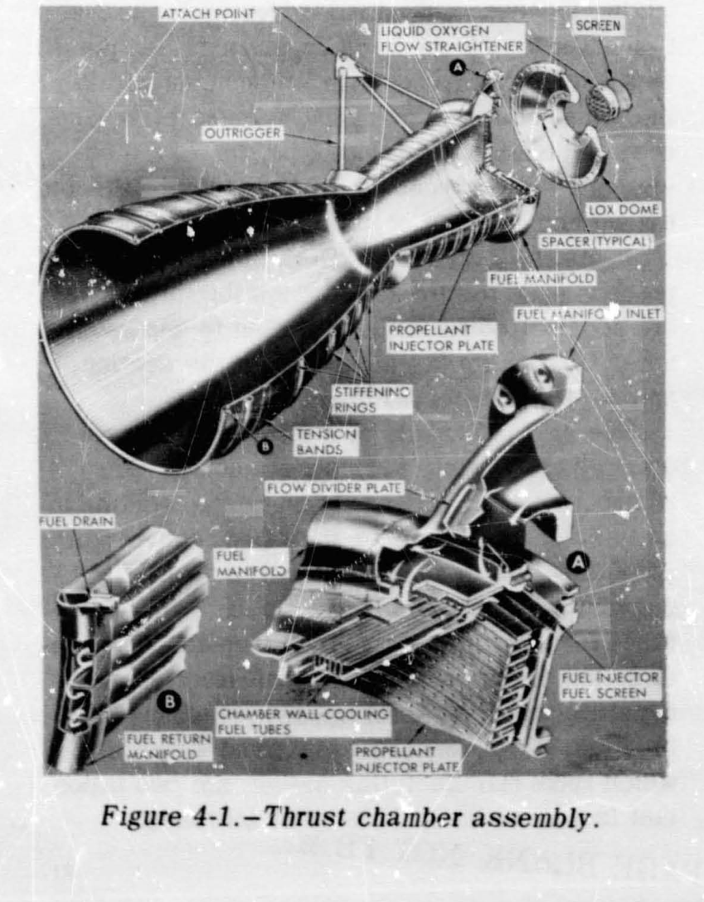
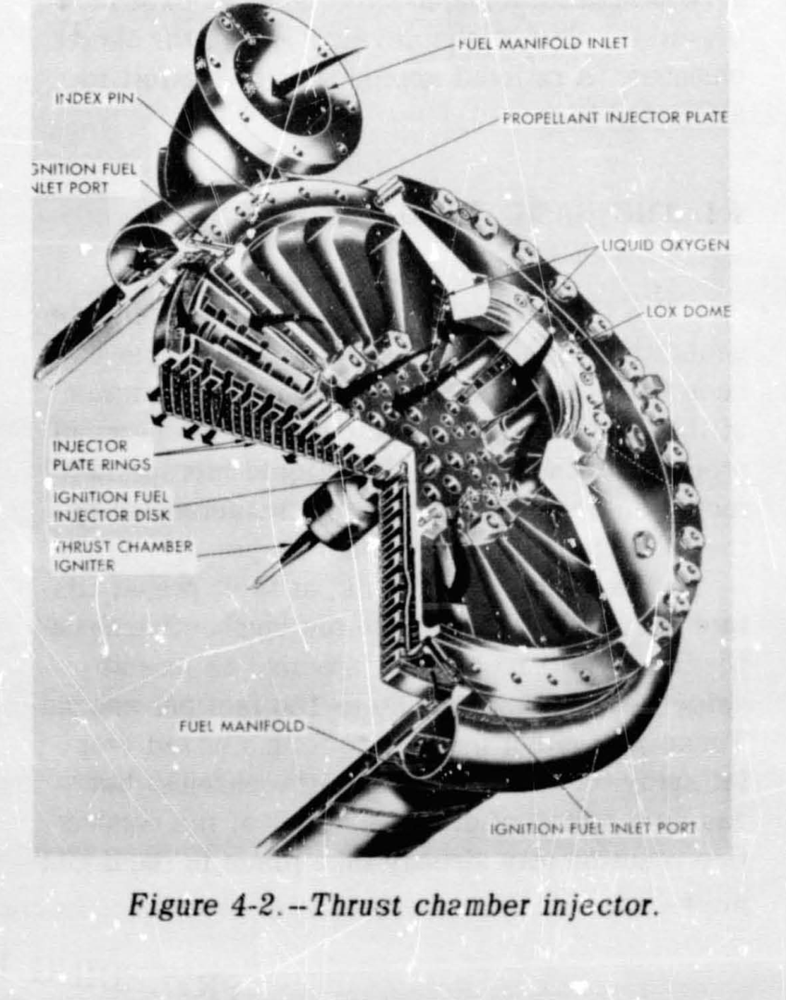
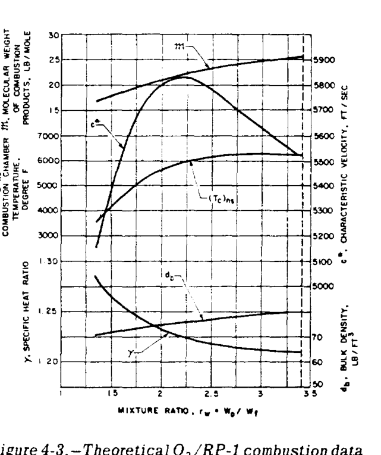
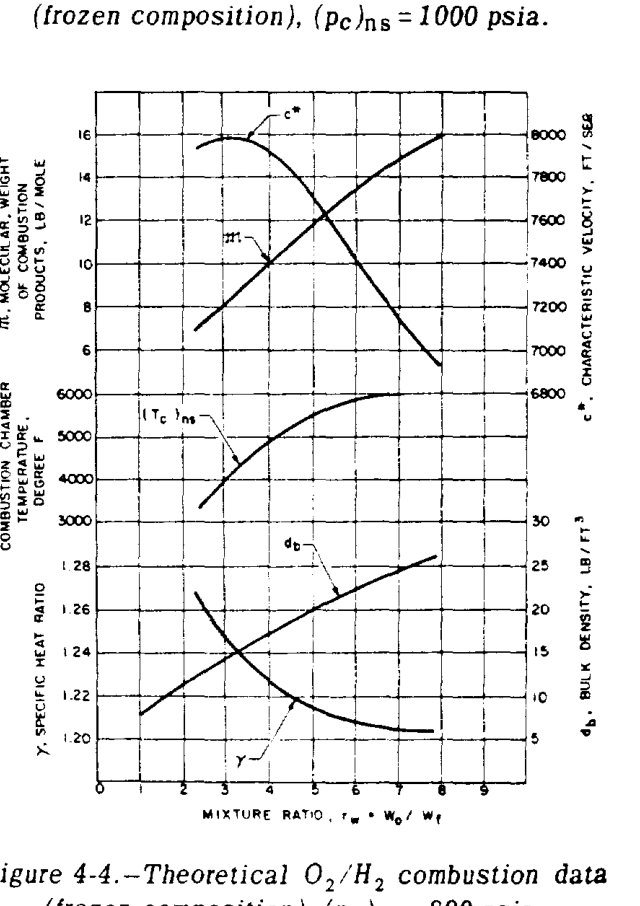
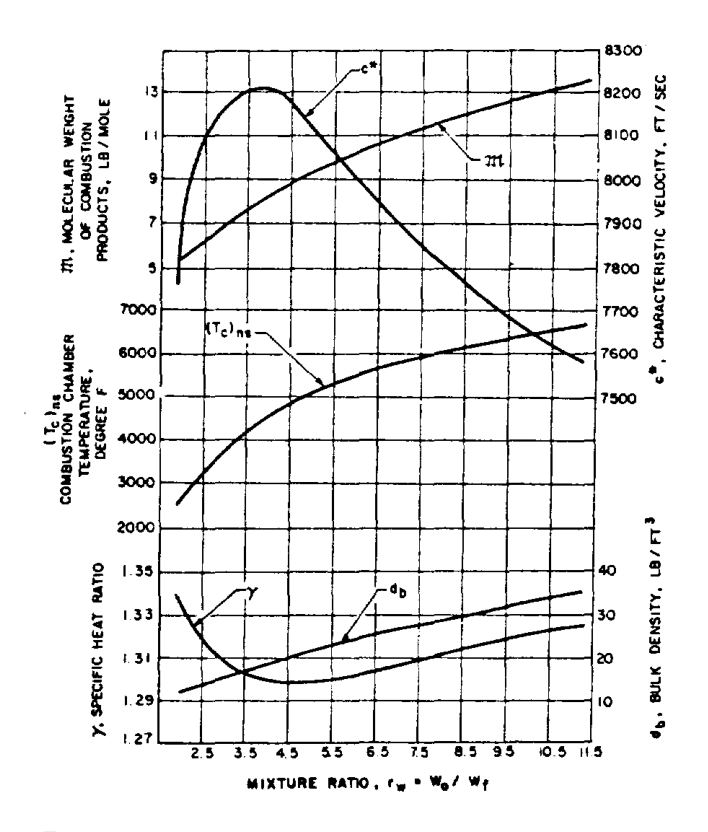
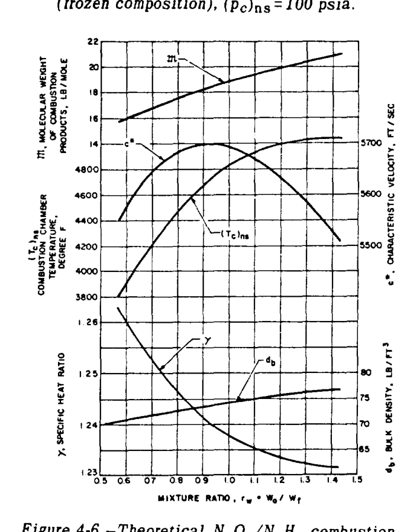

# 第4章 推力室およびその他の燃焼装置の設計

ロケットエンジンの様々なサブシステムの誇り高き設計者たちは、それぞれ自らの製品を「エンジンの心臓」と考えているが、推力室アセンブリがロケット推進のエッセンスを体現していることは否定できない。すなわち、物質を加速して排出することであり、その反作用が車両に推進力を与える。設計者の目標は、本質的に、最大の性能、安定性、耐久性を備え、かつ最小の寸法、重量、コストの装置でこれを達成することである。

推力室の設計は、液体推進薬ロケット工学の分野において最も複雑なテーマの一つである。これは主に、基礎となるプロセス、特に推力室内での燃焼を分析的に定義し研究することが比較的困難であるという事実に起因している。したがって、ほとんどのエンジン開発プログラムにおいて、主要な努力は推力室の設計と開発に費やされなければならない。ここでは、この取り組みに対する合理的なアプローチを試みる。

## 4.1 基本的な推力室の要素

推力室内での推力発生を支配する熱力学的プロセスについては、第1章で扱った。推力室の主な機能は、推進薬のエネルギーを推力に変換することである。液体二液式ロケットエンジンにおいて、このプロセスは以下の基本的な機能ステップによって特徴付けられる：

1. 液体推進薬は、適切な混合比で、インジェクタの噴射孔を通じて、毎秒20～150フィートの速度の噴流として燃焼室内に噴射される。これらの噴流は衝突して混合された液滴スプレーを形成するか、あるいは一連の液滴としてチャンバー内の高温ガスに直接流れ込む。燃焼反応の一部は、すでに液体の状態で発生している場合がある。
2. 液滴はその後、周囲のガスからの熱伝達によって蒸発する。液滴の大きさと速度は、燃焼ガスの流れに同伴される間に連続的に変化する。
3. 蒸発した推進薬は急速に混合され、さらに加熱されて、形成された場所で化学量論的な混合比で即座に反応し、燃焼室内のガス質量流量を継続的に増加させる。このガス反応は、活性分子や原子の高速拡散によってさらに促進される。燃焼は、すべての液体液滴が蒸発した段階で、チャンバーのノズル喉部の上流で実質的に完了する。特定の条件下では、燃焼フロントにおける局所的な乱れ（おそらく、反応前の混合プロセスや推進薬の流れの不安定さによって引き起こされる）によって、衝撃波やデトネーション波が発生することがある。これらの影響は、推力室内で特定の周波数での持続的な圧力振動を誘発し、破壊的な燃焼不安定性をもたらす可能性がある。したがって、設計および開発の多大な努力は、安定した燃焼の達成に向けられる。
4. 燃焼プロセスのガス生成物は、喉部に向かって通過し、そこを通過する際に音速に加速され、その後、末広ノズル部で超音速に加速され、最終的に後方に排出される。

その機能のために必要な推力室の基本要素には、燃焼室部、膨張ノズル部、インジェクタ、点火装置（非自己着火性推進薬の組み合わせ用）、推進薬入口および分配マニホールド、ならびにコンポーネントおよび推力マウント用の接続面が含まれる。様々な推力室要素の構造は、それらの具体的な運転機能に大きく依存する。しかし、製造を容易にする軽量化と簡素化は、常に考慮すべき2つの重要な要因である。

図4-1および図4-2は、典型的な液体二液式ロケットエンジンの推力室アセンブリを示している。図示されている推力室アセンブリは、4つの主要なサブアセンブリまたは基本要素、すなわち推力室本体、インジェクタ、液体酸素ドーム、および点火器から構成されている。

推力室本体のサブアセンブリはベンチュリ形状であり、燃焼が行われる円筒部、喉部に向かって狭くなる部分、および燃焼ガスが排出されるベル型の末広ノズル部から構成されている（図4-1）。このチャンバーの本体壁は、長手方向に走るニッケルチューブで構成され、銀ろう付けによって接合され、外部のテンションバンドによって保持されている。壁厚0.012インチのチューブは、推力室の形状に適合するように、断面積が変化する長方形の断面を持っている。この構造により、チャンバー壁を形成するチューブに燃料を流すことで、運転中に推力室を簡単に冷却することができる。圧力下の燃料は、燃料マニホールド入口から推力室本体に入り、交互に配置された推力室チューブに分配される。その後、燃料は推力室ノズルの出口に向かって流れ、そこで燃料戻りマニホールドが流れを反転させて戻りチューブに送る。その後、燃料はインジェクタ燃料スクリーンを通って放射状のインジェクタ通路に流れ、最終的に燃料インジェクタオリフィスを通って推力室燃焼領域に入る。このチャンバーの燃料マニホールドは、4130鋼または347ステンレス鋼で作られている。テンションバンド、補強リング、アウトリガーなどの他の構造部材は、すべて4130鋼で作られている。酸化剤（液体酸素）は、スクリーン付きの中央ポートから圧力下でLOXドームに入り、ドーム内で液体酸素通路およびオリフィスに直接分配される（図4-2）。

以下は、図4-1に示されているものと類似した仮想的な推力室の運転特性および主要寸法である：

1. 推進薬:  $\text{LOX}/\text{RP-1}$ 
2. O/F 混合比:  $2.30$ 
3. 特性速度,  $c^*$ ,  $\text{ft/sec}$ :  $5400$ 
4. 推力係数,  $C_f$ （海面高度）:  $1.489$ 
5. 比推力,  $(I_s)_{\text{tc}}$ （海面高度）,  $\text{sec}$ :  $249$ 
6. 全推進薬流量,  $\text{lb/sec}$ :  $402$ 
7. 推力（海面高度）,  $\text{lb}$ :  $100\,000$ 
8. チャンバー圧力（インジェクタ端）,  $\text{psia}$ :  $520$ 
9. チャンバー圧力（ノズルよどみ点）,  $\text{psia}$ :  $480$ 
10. 平均ガス比熱比,  $(\gamma)$ :  $1.233$ 
11. 燃焼室断面積,  $\text{in}^2$ （インジェクタ位置）:  $244$ 
12. 喉部面積,  $\text{in}^2$ :  $140$ 
13. ノズル出口面積,  $\text{in}^2$ :  $1120$ 
14. 燃焼室容積,  $\text{in}^3$ （喉部より上流）:  $5320$ 
15. 燃焼室長,  $\text{in}$ （インジェクタから喉部まで）:  $28.5$ 
16. 特性チャンバー長,  $L^*$ ,  $\text{in}$ :  $38$ 
17. 全長,  $\text{in}$ :  $73$ 
18. 設計収縮面積比,  $\epsilon_c$ :  $1.60:1$ 
19. 設計膨張面積比,  $\epsilon$ :  $8:1$ 

推力室インジェクタ（図4-2）は、丸いプレートであり、ドリルで開けられたオリフィスに通じる円形および放射状の内部通路がハニカム状に配置されている。これは4130鋼製で、表面にはニッケルメッキが施されており、高強度ボルトによって液体酸素ドームの下の燃料マニホールド位置に固定されている。インジェクタと推力室本体の間のシールは、燃料（RP-1）との適合性を考慮して選ばれたゴム製のOリングタイプである。インジェクタ面の中心にはネジ穴が設けられており、火工品式の推力室点火器を取り付けることができる。インジェクタには20個の円形同心銅リングがあり、これらに噴射オリフィスが含まれ、主要な推進薬システムから供給される。燃料と酸化剤は、交互のリングに供給する精巧な分配システムによって分離されている。燃料は最も外側のリング、1つおきの内側リング、および点火燃料入口ポートから点火燃料バルブを介して別途供給される中央燃料ディスクを通って流れる。液体酸素は残りのリングから出てくる。噴射オリフィスは、推進薬が推力室燃焼領域で同種衝突パターン（液体酸素同士、および燃料同士）で衝突するように角度が付けられている。主要なオリフィスはペアで配置されており、両方の推進薬において中心線間距離が0.416インチ、挟角40°の衝突角となっている。他の設計では、2つの推進薬に対して衝突角やオリフィス間隔を異ならせ、異なる平面で衝突させるようにすることがある（単一平面衝突に対して多平面衝突）。

液体酸素ドームは、単一ピースの2014-T6アルミニウム合金型鍛造品である。これは液体酸素の入口を提供する。また、推力室から車両への取り付けインターフェースとしても機能する。液体酸素ドームとインジェクタのフランジは、アスベストフィラーを挟んだ304ステンレス鋼ストリップで作られたスパイラルウウンドガスケットによってシールされている。このタイプのガスケットは、極低温および高温用途向けに特別に設計されている。

電気点火式の火工品点火器は、ネジ結合によってインジェクタ表面の中央に固定されている。これは1回限りの起動用に設計されており、各燃焼後に交換する必要がある。ノズル出口を介して接続されたワイヤから電気的な点火信号を受け取る。

## 4.2 推力室性能パラメータ

推力室の運転効率を表す、またはそれに影響を与えるパラメータの重要性については、第1章のセクション1.3で説明した。実際の推力室設計の詳細を説明する前に、以下にこれらのパラメータを要約し、第3章で議論したアルファ車両のエンジンシステムに適用して設計計算への使用例を示す。

### 比推力,  $I_s$  ( $\text{sec}$ )

式(1-31)および(1-31c)より：

$$ 
(I_s)_{\text{tc}} = \frac{F}{\dot{w}_{tc}} = \frac{c^* C_f}{g}
$$

比推力の数値は、推力室設計の総合的な品質を示す。以前に学んだように、これは「流れる推進薬の消費量」に対してどれだけの推力が発生するかを示す。

### 特性速度,  $c^*$  ( $\text{ft/sec}$ )

式(1-32a)より：

$$ 
c^* = f(\gamma, R, (T_c)_{ns}) \tag{4-1}
$$

推進薬と混合比の選択が行われたと仮定すると、ガスの特性（ $\gamma, R$ ）は既知の範囲に収まることが期待できる。そこから先は、 $c^*$ はほぼ完全にガスの温度に依存する。明らかに、この温度は選択された推進薬の組み合わせに対して理論的な最大値を持つ。チャンバーがこの最大値にどれだけ近づいて作動するかは、第2章で混合比について議論された影響に依存する。図4-3、4-4、4-5、および4-6はこれを示している。 $c^*$ は最大燃焼温度よりもやや低い温度でピークに達することがわかる。車両のタンクサイズに影響を与えるバルク密度などの他の考慮事項により、最適な車両全体の性能を得るために混合比がさらに調整される場合がある。これらの境界内で、燃焼プロセスの品質は推力室アセンブリ、特にインジェクタの設計効率に大きく依存する。

### 推力係数,  $C_f$  (無次元)

式(1-33a)より：

$$ 
C_f = f(\gamma, \epsilon, p_a) \tag{4-2}
$$

燃焼プロセスによるエネルギー生成の性能（その影響は $c^*$ について要約されたばかりである）が決定されたと仮定しよう。その場合、与えられたガス特性（ $\gamma$ ）に対して、推力室の残りの推力発生機能、基本的には末広ノズルの性能は、ノズルの形状（主に圧力比（ $p_e/(p_c)_{ns}$ ）を決定する $\epsilon$ ）および環境圧力（ $p_a$ ）に依存する。

### 性能計算

実際の設計実務において、推力室性能の計算は、理論的な推進薬燃焼データと、第1章で説明した特定の補正係数の適用に基づいている。理論的な推進薬燃焼データは、推進薬の組み合わせの反応熱と燃焼ガスのエンタルピー上昇を等しくする熱化学計算から導き出される。フローズン組成における代表的な推進薬燃焼データを図4-3から図4-6に示す。与えられた推進薬の組み合わせとチャンバー・ノズルよどみ点圧力 $(p_c)_{ns}$ に対して、燃焼ガス温度 $(T_c)_{ns}$ 、分子量 $\mathfrak{M}$ 、および比熱比 $\gamma$ の値が、O/F混合比 $r_w$ に対してプロットされている。性能補正係数は、理論的な仮定や以前のテストデータ、ならびに選択された設計構成から決定される。代表的な性能計算方法は、以前にサンプル計算(1-3)によって実証されている。以下のサンプル計算は、より具体的なアプローチを示している。

### サンプル計算 (4-1)

以下の設計パラメータを想定して、仮想的なアルファ車両の各段のエンジン推力室における $c^*$ 、 $C_f$ 、および $(I_s)_{tc}$ の設計値を決定せよ：

(a) **750K A-1段エンジン**:
推進薬:  $\text{LO}_2/\text{RP-1}$ ; 推力室 O/F 混合比:  $2.35$ ;  $(p_c)_{ns}$ :  $1000\text{ psia}$ ; 推進薬燃焼データ: 図4-3; ノズル膨張面積比:  $\epsilon = 14$ 。

(b) **150K A-2段エンジン**:
推進薬:  $\text{LO}_2/\text{LH}_2$ ; 推力室 O/F 混合比:  $5.22$ ;  $(p_c)_{ns}$ :  $800\text{ psia}$ ; 推進薬燃焼データ: 図4-4; ノズル膨張面積比:  $\epsilon = 40$ 。

#### 解答

**(a) A-1段エンジン**:

図4-3から、 $(p_c)_{ns} = 1000\text{ psia}$ 、混合比  $2.35$  の  $\text{LO}_2/\text{RP-1}$  について、チャンバー生成ガスに対して以下の値が得られる：

$$ 
(T_c)_{ns} = 6000^\circ\text{ F または } 6460^\circ\text{ R}
$$

$$ 
\mathfrak{M} = 22.5\text{ lb/mol}, \quad \gamma = 1.222
$$

式(1-32a)に代入する：

$$ 
\text{理論 } c^* = \frac{\sqrt{32.2 \times 1.222 \times 6460 \times 1544 / 22.5}}{0.7215} = 5810\text{ ft/sec}
$$

この $c^*$ の値は、図4-3からも導き出すことができる。

優れた燃焼室およびインジェクタ設計の場合、 $\text{LO}_2/\text{RP-1}$  およびフローズン組成に対する $c^*$ 補正係数は約  $0.975$  となる。

$$ 
\text{設計 } c^* = 5810 \times 0.975 = 5660\text{ ft/sec}
$$

 $\gamma = 1.222$ 、 $\epsilon = 14$  に対して、理論上の真空  $C_f$  値  $1.768$  は図1-11から導き出すことができる：

$$ 
\text{理論 } C_f \text{ at sea level} = (C_f)_{\text{vac}} - \frac{\epsilon p_a}{(p_c)_{ns}}
$$

$$ 
= 1.768 - \frac{14 \times 14.7}{1000} = 1.562
$$
